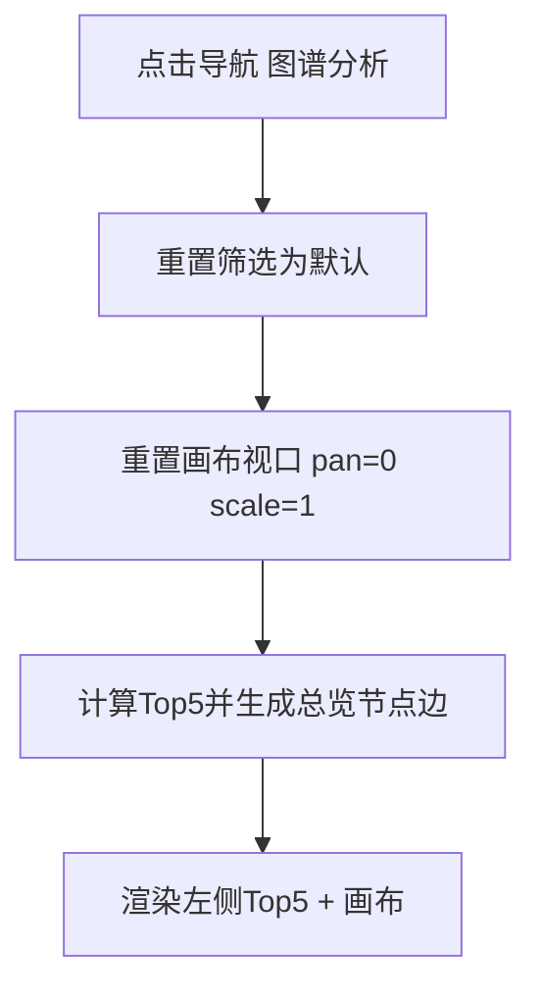
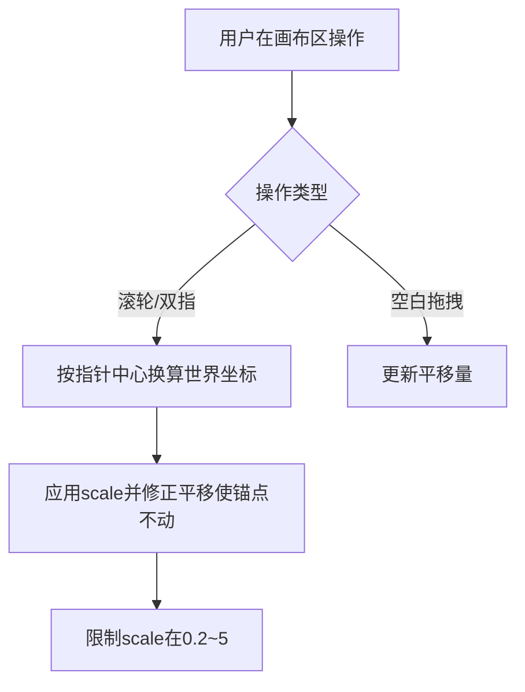
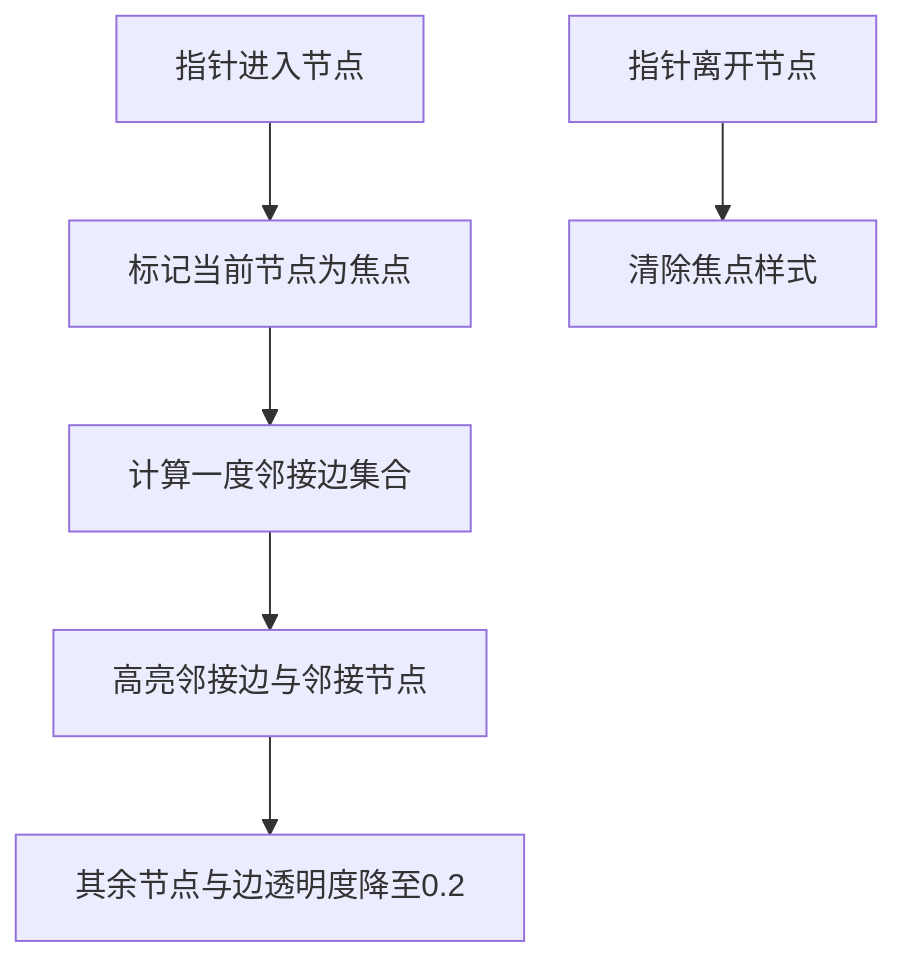

# 图谱分析模块需求文档（PRD）

**文档版本**：V1.0  
**适用产品**：合规与安全运营 Demo（`demo`）  
**状态**：与当前前端实现（图谱可视化 + 交互）对齐；后端/API 为待对接项时单独标注「待确认」。

---

## 1. 文档说明

### 1.1 文档目的

本模块以**资产—漏洞—合规检查项**为核心对象，通过**关系图谱**呈现风险暴露与合规关联，支撑安全运营人员快速理解「哪些资产风险集中、漏洞与合规项如何交织」。本文档用于：

- 统一产品、研发、测试对**范围与验收口径**的认知；
- 作为后续迭代（真实数据接入、布局算法升级等）的基线说明。

### 1.2 读者对象

- 产品经理 / 业务方：确认场景与优先级；
- 研发：实现与联调依据；
- 测试：编写用例与验收；
- 运营与一线分析人员：理解能力边界与操作方式。

---

## 2. 背景与目标

### 2.1 背景

在资产风险与合规管理场景中，表格与列表适合检索，但难以直观表达「同一资产下多漏洞、多合规项及跨类型关联（如漏洞—合规交叉）」的整体结构。图谱视图可将**核心实体**与**一度关系**同时呈现，降低认知成本。

### 2.2 目标

| 维度 | 说明 |
|------|------|
| **业务目标** | 用户进入图谱分析后，默认即可看到**核心风险资产摘要 + 基础关系图**，并能在图上完成浏览、筛选与下钻。 |
| **体验目标** | 图谱支持**缩放、平移、悬停聚焦、节点临时拖拽**，保证大图可读性与细节查看能力。 |
| **结果目标** | 用户能在 1 分钟内理解当前视图代表的数据子集（Top 风险资产范围、筛选条件），并能定位到单资产或单节点详情。 |

### 2.3 成功指标（建议）

以下指标可在真实数据与埋点就绪后启用：

- **任务完成率**：进入模块后，用户能在无培训情况下完成「筛选 → 看图 → 打开节点详情」的比例；
- **平均停留与操作**：图谱区有效交互（缩放/平移/点击）次数与停留时长处于合理区间（非「进入即离开」）；
- **缺陷率**：与图谱交互相关的 P0/P1 缺陷数为 0（上线初期）。

---

## 3. 术语与实体

| 术语 | 说明 |
|------|------|
| **资产节点** | 表示一条业务系统/设备资产，展示名称、IP、风险分等摘要。 |
| **漏洞节点** | 表示该资产下的漏洞实例，含名称、CVE、等级等。 |
| **合规节点** | 表示该资产下的合规检查项，含检查项名称、所属文件、通过/未通过等。 |
| **边（关系）** | 资产—漏洞、资产—合规为直接关系；漏洞—合规可为**交叉关联**（跨类型边，用于表达修复或映射关系）。 |
| **一度关联** | 与某节点直接相连的节点或边（无向图意义下与 `node` 相邻的边及其另一端点）。 |
| **总览视图** | 多资产及其子节点在同一画布上的默认展示；侧重全局对比。 |
| **下钻视图** | 选中某一资产后，仅展开该资产及其漏洞、合规与交叉边的局部视图。 |

---

## 4. 用户与场景

### 4.1 目标用户

- 安全运营 / 风控分析人员；
- 合规检查协同人员；
- 单位侧资产责任人（只读浏览场景）。

### 4.2 核心场景

1. **全局巡检**：打开图谱分析，默认看到 Top 风险资产与关系总览，识别高风险聚集区域。
2. **条件收窄**：按 IP、业务名、漏洞名、合规文件/检查项、漏洞等级等筛选，聚焦子集。
3. **单资产深挖**：点击资产节点进入下钻视图，查看该资产全部漏洞与合规及交叉关系。
4. **节点取证**：对漏洞或合规节点查看详情、或发起「以该节点为条件」的检索（Demo 中为新开页带参）。
5. **大图阅读**：通过缩放、平移浏览全局；通过悬停高亮一度关系，避免「线多眼晕」。

---

## 5. 需求范围

### 5.1 In Scope（本期已实现 / 文档对齐范围）

1. **模块入口**：主导航「图谱分析」进入独立面板页。
2. **默认展示**：每次进入该模块，**重置为总览视图**（筛选条件恢复默认、画布视口恢复默认、展示 Top 风险资产列表 + 总览图谱）。
3. **筛选区**：资产 IP、资产业务系统名称、漏洞名称、合规文件、检查项、漏洞等级；支持「查询」「重置」。
4. **左侧栏**：总览下展示 **Top5 风险资产**（排序规则见下文）；点击某项可下钻至对应资产。
5. **画布区**：关系图谱；支持 **滚轮缩放、双指缩放、空白处拖拽平移**；缩放范围 **0.2x～5x**，缩放锚点为**指针/双指中心**（非画布几何中心）。
6. **节点交互**：
   - **悬停**：当前节点约 **1.2 倍**放大；**高亮**与该节点**一度关联的边**；其余节点与边**透明度降至约 20%**。
   - **拖拽**：节点可拖动以缓解重叠；**释放后**节点在受力近似下**回弹至布局平衡位置**（初始算法给出的坐标）。
7. **节点类型行为**：
   - 点击**资产节点**：进入该资产下钻视图；面包屑更新；左侧可切换为节点详情（与实现一致）。
   - 点击**漏洞/合规节点**：刷新高亮并展示侧栏详情，且在节点旁展示操作气泡（查看详情、以该节点搜索等，与实现一致）。
8. **面包屑与返回**：下钻后展示「全部资产 > 资产名(IP)」；支持返回上一级回到总览。
9. **URL 参数（Demo）**：支持通过查询参数带入筛选或聚焦节点（如 `focusNodeId`），用于新开页联动（与实现一致）。

### 5.2 Out of Scope（本期不做或仅 Demo 级）

| 项 | 说明 |
|----|------|
| **真实后端数据接入** | 当前为前端 Mock；生产环境需对接资产/漏洞/合规 API 与权限。 |
| **力导向实时仿真** | 仅「拖拽释放后的回弹动画」，非持续物理引擎布局。 |
| **大规模图优化** | 如上千节点时的虚拟化、LOD、WebGL 等，本期不承诺。 |
| **协同编辑与版本** | 不支持多用户同时编辑节点位置持久化。 |
| **导出图片/PDF** | 未纳入本期需求。 |

---

## 6. 模块信息总览

### 6.1 信息架构

```text
图谱分析
├── 页头：标题、面包屑、返回上一级（下钻时出现）
├── 筛选区：多条件检索 + 漏洞等级 + 查询/重置
├── 左侧栏
│   ├── Top5 风险资产（总览默认）
│   └── 节点详情 / 返回 Top5（下钻或点选非资产节点时）
└── 主画布：关系图谱（节点 + 边 + 交互视口）
```

### 6.2 页面布局说明

- **筛选区**：横向排布若干字段，占位提示给出输入示例（如 IP、业务名、漏洞名等）。
- **左侧栏**：固定宽度列表区，展示 Top5；下钻或点选节点后可切换为结构化详情文本。
- **画布区**：带浅色网格底纹与角标水印（如 `OPS://GRAPH`），用于强化「分析画布」心智（实现级 UI，可随品牌调整）。

### 6.3 默认进入行为（强约束）

用户**每次点击导航进入「图谱分析」**时：

- 筛选条件恢复为**默认空/全部**；
- 图谱回到**总览视图**（非停留在上一次下钻状态）；
- 画布**平移归零、缩放 1x**（避免上次操作残留导致「进页面看不清」）。

> 说明：若业务希望「保留上次下钻状态」，需单独评审并改为可配置策略；当前实现为**每次进入重置总览**，更利于演示与首次理解。

---

## 7. 功能设计（细化）

### 7.1 风险资产排序与 Top5 规则

在参与排序的候选资产集合上（见筛选），按以下规则排序后取前 **5** 条展示：

1. **含高危漏洞**的资产优先于不含高危的资产；
2. 在同档内按 **（漏洞数量 + 未通过合规项数量）** 降序。

展示字段建议包含：排名、资产名称、综合指标值；Hover 可展示漏洞数、不合规数等摘要（与实现一致即可）。

### 7.2 筛选与查询

| 字段 | 匹配逻辑（产品口径） |
|------|----------------------|
| 资产 IP | 包含匹配（忽略大小写） |
| 资产业务系统名称 | 包含匹配 |
| 漏洞名称 | 在漏洞列表中匹配名称（可与漏洞等级组合） |
| 合规文件 | 在合规列表中匹配文件名字段 |
| 检查项 | 在合规列表中匹配检查项名称 |
| 漏洞等级 | 过滤漏洞等级；若仅选等级且无其他关键字时，保留「仍存在该等级漏洞」的资产 |

**查询**：在总览模式下按条件重算图谱；在下钻模式下，若产品定义为「仅重算当前资产子图」，则与实现一致（当前 Demo：下钻时查询会刷新当前资产视图）。

**重置**：清空条件并回到总览默认图谱。

### 7.3 图谱总览（多资产）

- 每个入选资产在圆周上占位，周围辐射挂接漏洞节点、合规节点。
- 资产之间存在**视觉分离**，便于对比；漏洞/合规与资产之间为**直线边**。
- **交叉边**（漏洞—合规）使用可区分样式（如虚线/条纹），表达跨类型关系。

### 7.4 图谱下钻（单资产）

- 资产节点居中或作为主 hub，左右或周向分布漏洞与合规（与实现布局一致即可）。
- 面包屑：**全部资产 > 资产名称(资产 IP)**。
- 左侧详情区：展示资产、漏洞列表摘要、合规列表摘要，并标注当前点击节点（若适用）。

### 7.5 画布视口与导航交互

#### 7.5.1 缩放

- **鼠标滚轮**：向上放大，向下缩小。
- **触控双指**：捏合缩小、张开放大。
- **范围**：缩放倍数限制在 **\[0.2, 5.0\]**；到达边界时不再继续放大/缩小。
- **锚点**：以**指针位置**或**双指中心**为缩放中心，避免「只能看画布中心」导致浏览大图困难。

#### 7.5.2 平移

- **左键**在画布**空白区域**按下并拖动，平移整个图谱。
- **光标**：默认 `grab`，拖动中为 `grabbing`。
- **不触发平移**：左键从节点上按下时优先走节点拖拽逻辑（见下）。

#### 7.5.3 节点悬停（Hover）

- **当前节点**：缩放至约 **1.2 倍**（以节点锚点为中心，避免飘移）。
- **一度关联边**：与当前节点直接相连的所有边**高亮**（更粗/更高对比色，产品可定义色板）。
- **其余元素**：其他节点与边透明度降至约 **20%**，突出焦点子图。
- **离开节点**：恢复默认视觉状态。

#### 7.5.4 节点拖拽与回弹

- 用户可拖动节点以临时缓解重叠。
- **释放鼠标**后，节点在**阻尼弹簧**作用下回到**初始布局平衡位置**（进入视图时由布局算法写入的平衡坐标）。
- **不持久化**自定义坐标（本期）；刷新页面或重建视图后恢复布局。

### 7.6 节点详情与动作

- **漏洞 / 合规节点**：支持弹出详情模态框（字段以业务字典为准）；支持「以该节点搜索」类动作（Demo 可为新开页带查询参数）。
- **操作气泡**：出现在节点附近，不遮挡主文案；点击空白处可关闭（与实现一致）。

### 7.7 URL 与外部联动（Demo）

支持通过 URL 查询参数驱动：

- 带入筛选条件并刷新总览；
- `focusNodeId`：在能解析到所属资产时，自动下钻并定位节点（用于外部模块跳转联动）。

生产环境需补充：鉴权、参数校验、防开放重定向与 XSS。

---

## 8. 交互主流程（Mermaid）

### 8.1 进入模块与总览



### 8.2 缩放与平移



### 8.3 悬停聚焦



---

## 9. 非功能与约束

| 类别 | 要求 |
|------|------|
| **性能** | 在 Demo 数据规模下交互流畅；正式环境需按节点规模评估（Out of Scope 见上）。 |
| **可访问性** | 图谱为强视觉模块，建议后续补充键盘可达性与屏幕阅读器说明（本期不强制）。 |
| **浏览器** | 现代浏览器；触控设备需支持 `touch-action` 与双指手势（与实现一致）。 |
| **安全** | 生产对接后，所有节点与详情需走权限模型；URL 参数需校验。 |

---

## 10. 验收标准（UAT）

### 10.1 功能验收（节选）

1. 每次从主导航进入「图谱分析」，页面为**总览视图**，筛选为默认，画布缩放与平移为默认状态。
2. 筛选条件变更后点击「查询」，图谱与 Top5 与统计区与条件一致；「重置」恢复默认总览。
3. 点击 Top5 中某资产或图中资产节点，进入**下钻视图**，面包屑与返回按钮表现正确。
4. 滚轮与双指缩放均在 **0.2x～5x** 内；缩放中心跟随指针/双指中心。
5. 空白处拖拽可平移图谱；拖拽中光标为 `grabbing`。
6. 悬停节点时：节点约 1.2x，一度边高亮，其余约 20% 透明度。
7. 拖拽节点后松手，节点回弹至初始平衡位置；拖拽过程不应产生明显卡顿（Demo 数据规模下）。

### 10.2 用户故事 + Given/When/Then（示例）

**故事 1：作为分析人员，我希望进入图谱就看到总览，以便快速建立全局印象。**

- Given 用户位于其他模块  
- When 点击「图谱分析」  
- Then 展示 Top5 与总览图谱，筛选与视口为默认状态  

**故事 2：作为分析人员，我希望悬停节点时突出一度关系，以便在复杂连线中不迷路。**

- Given 总览图谱已渲染且节点存在邻接边  
- When 鼠标悬停某一节点  
- Then 该节点放大，一度关联边高亮，其余节点与边显著变淡  

---

## 11. 风险、依赖与待确认

### 11.1 风险

| 风险 | 影响 | 缓解 |
|------|------|------|
| 真实数据规模远大于 Demo | 卡顿、难以阅读 | 分页/聚合、采样、分层展开 |
| 关系统计口径不一致 | 用户不信任图谱 | 与资产、漏洞、合规主数据字典对齐 |
| URL 参数联动 | 误跳转或信息泄露 | 鉴权、白名单参数、审计日志 |

### 11.2 依赖

- 资产主数据、漏洞库、合规检查结果的数据源与更新频率；
- 统一身份与权限（谁能看哪些资产/节点字段）。

### 11.3 待确认（产品）

1. 进入模块是否**永远**重置总览，还是记忆上次视图（需二选一可配置）。
2. 下钻态下「查询」是否允许切换到其他资产（跨资产）——当前 Demo 行为以研发实现为准，建议产品明确。
3. 交叉边业务语义是否统一为「修复映射」或「证据关联」等，需在数据侧定义。

---

## 12. 附录：与实现对齐说明（便于研发自查）

- 前端实现目录：`demo/app.js`（图谱数据、布局、视口变换、交互）、`demo/styles.css`（图谱样式与 hover 状态）、`demo/index.html`（结构入口）。
- 本文档**不以代码替代需求**：若代码与文档冲突，以**本文档 + 评审结论**为准修订代码或修订文档。

---

**文档结束**
