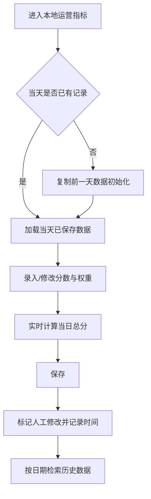

# 本地运营指标模块需求文档（PRD）

## 1. 背景与目标

- **背景**：当前系统已有“安全运营指标”模块，但缺少“本地运营指标”视角，无法按天记录本地运营执行质量并产出总分。
- **目标**：在“安全运营指标”后新增“本地运营指标”模块，支持指标管理、每日打分、权重计算、历史查询。
- **核心结果**：形成“可维护指标 + 每日可追溯分数 + 可查询历史总分”的闭环能力。

## 2. 用户与场景

- **目标用户**：安全运营人员、本地运营负责人、审计/管理人员。
- **核心场景**：
  - 每天录入前一天的本地运营指标数据。
  - 根据实际情况人工修正当天展示数据。
  - 按日期检索任意一天指标明细和总分。

## 3. 需求范围

### 3.1 In Scope（本期实现）

1. 在“安全运营指标”后新增“本地运营指标”模块入口与页面。
2. 默认内置 7 个指标：
   - 资产信息泄漏检查
   - 等保备案
   - 等保评测
   - 基线检查
   - 代码审计
   - 威胁情报
   - 安全服务
3. 支持指标自定义新增、删除。
4. 支持为每个指标手工录入“分数”“权重”，并自动计算当日运营总分。
5. 支持按天记录本地运营指标：
   - 默认展示前一天数据；
   - 若当天有人工修改，展示人工修改后的数据。
6. 支持检索任意一天的指标数据及总分。

## 4. 功能设计

### 4.1 模块入口与页面布局

- 在导航中“安全运营指标”后新增“本地运营指标”。
- 页面分三块：
  1. 顶部：日期选择 + 搜索 + 新增指标按钮；
  2. 中部：当日运营总分展示（含更新时间、是否人工修改标记）。
  3. 底部：指标表格（指标名称、分数、权重、加权得分、操作）；

### 4.2 默认指标初始化规则

- 首次进入模块时，若无指标配置，自动写入 7 个默认指标。
- 已有配置时，不重复初始化。

### 4.3 指标管理规则（新增/删除）

- 新增指标：
  - 必填：指标名称；
  - 默认分数=0，默认权重=0；
  - 名称不可与现有指标完全重复。
- 删除指标：
  - 需二次确认；
  - 删除后不影响历史日期已落库快照（历史仍可查看）。

### 4.4 分数与权重录入规则

- 分数：0-100，支持最多 2 位小数。
- 权重：0-100，支持最多 2 位小数。
- 权重建议总和=100：
  - 若不等于100，页面提示“权重总和异常”，但仍允许保存（按实际权重计算）。

### 4.5 总分计算规则

- 公式：`当日总分 = Σ(单指标分数 × 单指标权重 / 100)`
- 展示保留 2 位小数。
- 每次编辑分数或权重后实时刷新总分。

### 4.6 每日数据记录规则

- 新建当天记录时，默认复制“前一天”的指标数据（分数、权重、指标列表）。
- 若当天有人工修改：
  - 页面展示修改后的值；
  - 标记“人工已修改”；
  - 记录修改时间与修改人（如系统已有用户信息）。

### 4.7 按日期搜索规则

- 支持选择任意日期查询；
- 查询结果包含：
  - 当天指标明细（名称、分数、权重、加权得分）；
  - 当天运营总分；
  - 数据来源状态（默认继承/人工修改）。
- 若无数据：
  - 展示空状态提示“该日期暂无数据”；
  - 提供“基于前一天初始化”入口。

## 5. 数据模型建议（简化）

### 5.1 指标定义表（metric_def）

- id
- metric_name
- is_active
- created_at
- created_by

### 5.2 每日指标快照表（metric_daily_snapshot）

- id
- biz_date（业务日期）
- metric_name（快照字段，避免历史受定义变动影响）
- score
- weight
- weighted_score
- is_manual_modified
- modified_at
- modified_by

### 5.3 每日汇总表（metric_daily_total）

- id
- biz_date
- total_score
- is_manual_modified
- updated_at
- updated_by

## 6. 交互流程（Mermaid）

## 7. 非功能与约束

- 列表编辑后保存响应建议 <= 2 秒。
- 计算逻辑前后端口径一致，避免总分不一致。
- 关键操作（删除指标）需有确认提示。

## 8. 验收标准（UAT）

1. 能在“安全运营指标”后看到“本地运营指标”模块入口。
2. 默认7项指标正确初始化且仅初始化一次。
3. 可新增指标并立即参与总分计算。
4. 可删除指标且删除后历史日期数据仍可查询。
5. 分数与权重可录入，数值校验生效。
6. 总分按公式正确计算并保留2位小数。
7. 当天首次进入自动继承前一天数据。
8. 当天有修改后展示修改值与修改标记。
9. 可查询任意一天指标明细与总分。
10. 无数据日期显示空状态并支持快速初始化。

## 9. 测试用例（10条）

1. **默认初始化**：首次进入模块 -> 预期出现7个默认指标。
2. **防重复初始化**：再次进入模块 -> 预期仍为现有指标，不重复新增默认项。
3. **新增指标**：新增“漏洞响应时效” -> 预期新增成功并可录入分数权重。
4. **删除指标**：删除“威胁情报” -> 预期当前日不再展示该项，历史快照仍可查。
5. **分数校验**：输入分数 120 -> 预期提示超范围，不允许保存。
6. **权重校验**：输入权重 -5 -> 预期提示超范围，不允许保存。
7. **总分计算**：两项分数分别80/90，权重50/50 -> 预期总分85.00。
8. **继承前日**：当天无数据 -> 预期自动载入前一天指标值。
9. **人工修改标记**：当天修改任一项并保存 -> 预期显示“人工已修改”与更新时间。
10. **按日搜索**：查询指定历史日期 -> 预期返回当日明细与总分；无数据则空状态提示。

## 10. 待确认项

- 权重总和不等于100时，是“允许保存+提示”还是“禁止保存”？
- 是否需要对“新增/删除指标”设置角色权限？
- 人工修改记录是否需保留修改日志明细（修改前/后）？
- 日期口径是否固定为自然日（00:00-23:59）？

